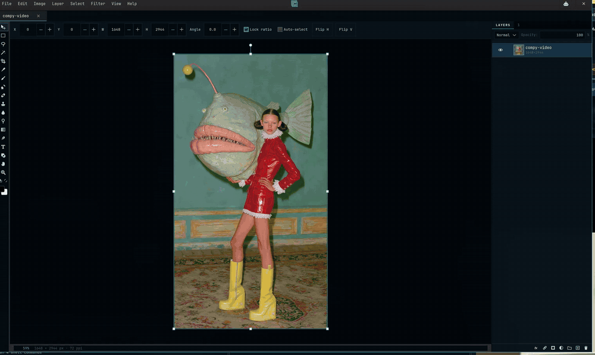
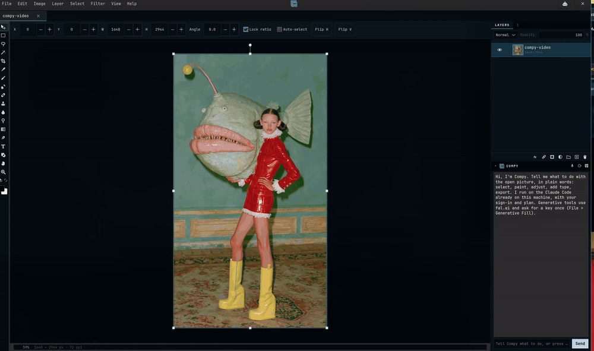
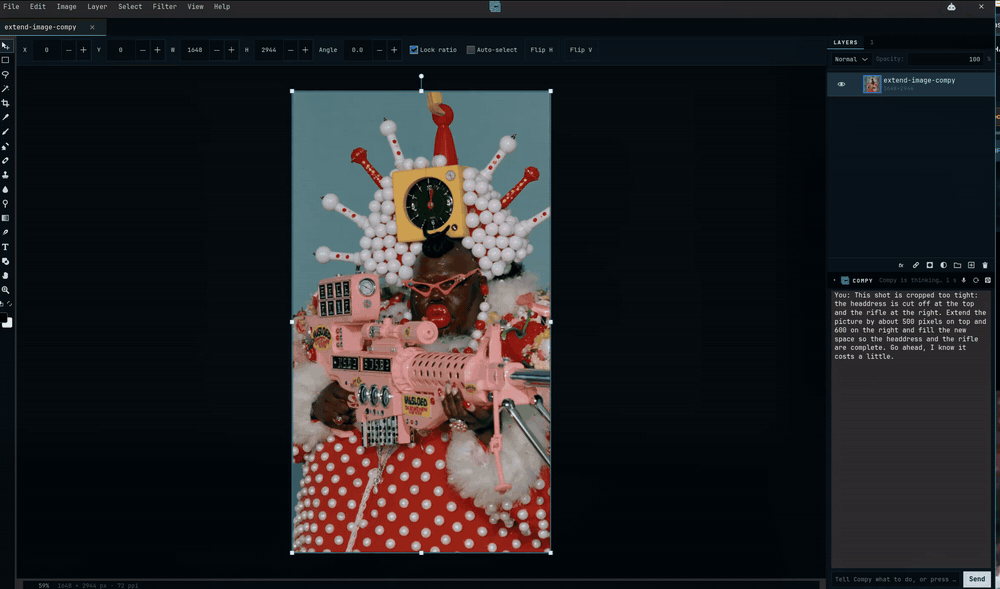

# Compy

A layer-based image editor for Linux, in the shape of Photoshop, with an AI assistant built in. Native
GTK4, written in Rust, built for Omarchy and at home on any Linux desktop.



*Fifty seconds around the editor: Curves on a selection, a blurred duplicate on Screen for a glow,
textured brush tips, type with a glow and a stroke from the Layer Style window, a gradient vignette,
History, Export Sizes, and the picture reframed into Instagram, Story and X artboards.
[Video](https://github.com/fluxcapctr/compy/releases/download/v0.1.1/compy-tour.mp4).*

Compy started as a Linux rebuild of [Compositor](https://github.com/robbietilton/Compositor), a macOS
editor whose C pixel core (`csrc/`) is compiled here unchanged. Everything around it is new: the
compositing engine, the tools, the file formats and the assistant.

## Highlights

- **Layers the way you expect.** Groups, masks, clipping masks, adjustment layers (15 kinds), blend modes,
  opacity, layer styles (drop and inner shadow, glows, bevel, stroke, color, gradient and pattern overlays,
  Blend If), artboards, and a history panel. Every change is one undo step.
- **The tools.** Move with snapping and free transform, marquee, lasso, magic wand, color range, crop and
  straighten, brush with Photoshop `.abr` and GIMP brush tips, eraser, clone and pattern stamp, spot
  healing, blur and smudge, liquify, dodge, burn and sponge, gradients with any number of stops, pen paths
  that become editable vector shapes, point and paragraph type, eyedropper, zoom and hand.
- **Adjustments and filters.** Levels, curves, exposure, hue and saturation, color balance, vibrance,
  black and white, photo filter, threshold, posterize, shadows and highlights, selective color, channel
  mixer, gradient map, grain, auto tone, contrast and color; gaussian, motion and radial blur, unsharp
  mask, smart sharpen, high pass, noise, lens correction, content-aware fill, and a fade for whatever you
  did last.
- **Files.** Its own `.comp` project package, Photoshop `.psd` in and out (editable type and layer styles
  survive the round trip), and PNG, JPEG, TIFF, GIF, WebP, AVIF, BMP and HEIC. Export one document to
  every ad and social size at once, with the layout reframed, or as artboards to fix by hand.
- **Compy, the assistant.** Ctrl+K opens Compy, which runs Claude Code against the open document through
  a set of editor tools: it selects, paints, adjusts, styles, sets type, exports, and, with a fal.ai key,
  generates and edits pictures (Generative Fill and Expand, Nano Banana, GPT Image, upscaling,
  relighting). It talks about the picture, not the tools, and every tool call is an undoable step you
  watch happen. Dictation works through voxtype. Below, one sentence in and the layout out, at double
  speed ([full-speed video](https://github.com/fluxcapctr/compy/releases/download/v0.1.0/compy-demo.mp4)).

  
- **Generative Fill and Expand.** Select an area, or ask for more canvas, and describe what belongs
  there. Below, one sentence to the assistant: the canvas grows and the cut-off headdress and rifle are
  completed on their own layer, with the waiting cut out of the clip.

  

- **Made for Omarchy.** Compy fits Omarchy without setup. The whole chrome, the app icon and the header
  mark follow the active theme and change with it live when you run `omarchy theme set`. The assistant is
  Claude Code, the same agent you use with Omarchy: your sign-in, your plan, nothing extra to configure,
  and if it is not installed or signed in yet, Compy offers a button that does it. Dictation goes
  through voxtype, Omarchy's own. It installs as a regular Arch package. It runs on any other Linux
  desktop too, with the stock GTK look.
- **The small things.** Autosave every two minutes with recovery on the start page, rulers, guides, a
  grid, Photoshop's shortcuts and menu layout, and a right-click brush popover.

The binary and the crate are still called `compositor`, so every command below keeps working; `compy`
is an alias.

## Install

**One line, any Linux:**

```
curl -fsSL https://raw.githubusercontent.com/fluxcapctr/compy/main/get.sh | bash
```

On Omarchy and Arch that builds a proper package and installs it with pacman (sudo asks once).
Elsewhere it fetches the latest release and installs it under `~/.local`. Then open Compy from the app
menu, or run `compy`.

**Omarchy and Arch by hand**, the same package the line above builds:

```
git clone https://github.com/fluxcapctr/compy.git
cd compy/packaging/aur
makepkg -si
```

That builds `compy-git`, installs it with pacman, and puts Compy in the app launcher; `compy` runs it
from a terminal. Update later by running the same `makepkg -si` again.

**Any Linux**, from a release: download the tarball from the Releases page, unpack it, and run
`./install.sh` inside. It puts the binary in `~/.local/bin`, the image libraries it was built with in
`~/.local/lib/compy`, the icon and desktop entry under `~/.local/share`, and touches nothing in
`/usr`. Needs GTK 4.14 or newer from the distribution (Ubuntu 24.04, Fedora 40, Debian 13 or newer).

**From source**: a Rust toolchain plus the development packages (`gtk4 cairo pango libheif` on Arch;
`libgtk-4-dev libcairo2-dev libpango1.0-dev libheif-dev` on Debian and Ubuntu), then

```
git clone https://github.com/fluxcapctr/compy.git
cd compy
./install.sh
```

The `reference/` submodule (the macOS original, used as the specification) is not needed to build.

**AI setup, inside the app.** Press Ctrl+K. If anything is missing the assistant shows a strip with a
button for each thing: "Install Claude Code" or "Sign in to Claude Code" opens a terminal that does
exactly that (if you already use Claude Code with Omarchy, at most it is the sign-in), and "Add
fal.ai key" takes the key for generative pictures (fill, expand, new pictures, upscaling, relighting;
a few cents a picture, billed to your fal account). Everything else in Compy works without either.
Help > Set Up AI Tools brings the strip back any time. Optional: `libavif` for AVIF export and
`voxtype` for dictation.

Progress follows the phases in the build plan:

| Phase | State |
| --- | --- |
| 1. Read a `.comp` file and render it flat | Done. `compositor render` and `compositor info`. |
| 2. The viewer (GTK4 window, pan, zoom, layer panel) | Done. `compositor project.comp` opens the app. |
| 3. Wire in the C core tool by tool | Done. Wand, Levels, Add Noise, Grain, Lens Correction, Gradient Map, Content-Aware Fill, Heal Selection, undo. |
| 4. Brush and tiled rendering | Done. Brush, Eraser, Spot Healing Brush, Clone Stamp, Blur; live preview at any zoom. |
| 5. Transforms, selections and masks | Done. Move/scale/rotate with snapping, marquee and lasso, masks, clipping masks, mask painting. |
| 6. Files, sizes, adjustment layers, extras | Done, except the GPU brush and ONNX background removal (see below). |

## Build

Needs Rust (stable, edition 2024), a C compiler, the GTK4 and Cairo development packages (`gtk4` and
`cairo` on Arch; `libgtk-4-dev` on Debian, which pulls in Cairo), and `libheif` for HEIC. The build fetches
the ONNX Runtime library once (the `ort` crate), so the first build needs the network.

```
git clone --recurse-submodules <this repo>
cargo build --release
cargo test
./install.sh
```

`install.sh` builds the release binary and installs it for the current user only: `~/.local/bin/compositor`,
the app icon under `~/.local/share/icons/hicolor/`, and `~/.local/share/applications/compositor.desktop`,
which is what makes the app show up in launchers (Omarchy's included) and lets `.psd` and image files open
with it from a file manager. Nothing is written outside your home directory; run it again after pulling changes.

## Use

```
compositor project.comp [more.comp ...]  # open the viewer, one tab per project
compositor info  project.comp            # the layer tree, with what each layer carries
compositor render project.comp out.png   # flatten to a straight-alpha PNG at the document's resolution
compositor psd    project.comp out.psd   # write a layered Photoshop file (or in.psd out.comp to convert back)
compositor file.psd                      # open a Photoshop file in the viewer
compositor photo.jpg                     # open an image as a new document of its size
```

In the viewer: scroll to pan, Ctrl+scroll or pinch to zoom around the pointer, middle-drag or Space+drag
to pan, Ctrl+0 fits, Ctrl+1 is 100%, Ctrl+plus and Ctrl+minus step the zoom, Ctrl+O opens, Ctrl+W closes
the tab. The layers panel toggles visibility, collapses folders, and sets the selected layer's blend mode
and opacity, redrawing as you go. From 200% the canvas shows hard-edged document pixels; from 800% a
pixel grid. `--screenshot out.png [--zoom 4]` renders the window to a file and quits, for checking the UI
from a script (open popovers land beside it with a `-popover` suffix; `--pick-color` opens the color picker,
`--window WxH` asks for a size, though a tiling compositor decides); `COMPOSITOR_TRACE=1` prints each frame's draw time.

**Editing (phase 3).** The rail on the left holds the Magic Wand (W), Hand (H) and Zoom (Z). The wand's
options bar sets New / Add / Subtract (Shift adds, Alt subtracts while clicking), tolerance, point or
averaged sampling, this layer or all layers, and contiguous. The menu (top right) has Edit (Undo Ctrl+Z,
Redo Ctrl+Shift+Z), Select (All Ctrl+A, Deselect Ctrl+D, Inverse Ctrl+Shift+I), Image (Levels Ctrl+L,
Gradient Map, Grain) and Filter (Add Noise, Lens Correction, Content-Aware Fill Shift+F5, Heal Selection).
Filters run on the active image layer inside the selection, preview live on the canvas, and commit as one
undo step. Every pixel operation is the original C code; only byte order and premultiplication are handled
here. `--wand x,y` and `--filter levels` script those for screenshots.

**Painting (phase 4).** Brush (B), Eraser (E), Spot Healing Brush (J), Clone Stamp (S, Alt-click sets the
source) and Smear (R, with Liquify, Blur and Smudge modes: Liquify pushes pixels along the drag, Smudge
drags color, Blur softens) share size, hardness and opacity in the options bar; the brush's color swatch opens a
picker like Photoshop's (a saturation and value square with a hue strip beside it, hex and R G B fields, the colors used lately, saved swatches); `[` and `]` step the size, `{`
and `}` the hardness, and the number keys set opacity. Shift-click paints a straight line from where the
last stroke ended. Strokes follow a smoothed curve through the pointer samples, accumulate coverage in
256-pixel tiles with the opacity as a cap on the whole stroke, respect the selection, and commit as one undo
step. Painting past a layer's edge grows the layer. While a stroke is in progress the canvas draws a live
preview grid whose reduced copies are updated only where the stroke touched, so a 300-pixel brush on a
50-megapixel layer costs 10 to 20 ms per pointer step at any zoom and about 12 ms on mouse-up, because the
preview and its reduced copies become the layer's own pixels rather than being copied.

**Transforms, selections and masks (phase 5).** The Move tool (V) drags the active layer, or a whole folder,
with eight scale handles and a rotation handle above the top edge: Shift constrains, Alt scales from the
center, the corner handles keep proportions unless you hold Shift (or turn off Lock ratio), moves snap to
the canvas and to the other layers' edges and centers with a guide drawn along the match (Ctrl drags freely),
a click on empty canvas lets go of the layer so its handles disappear (a click on another layer changes
nothing unless Auto-select is on or Ctrl is held),
Ctrl-click or Auto-select picks the layer under the pointer, arrow keys nudge by 1 or 10 pixels, and the
options bar shows X, Y, W, H and angle you can type into, plus Flip H and Flip V. The Marquee (M) drags a
rectangle or ellipse (Shift squares it), the Lasso (L) draws freehand or, in Polygonal mode, click by click
(click the first corner, or press Return, to close; Backspace removes a corner; Escape cancels); Shift adds
and Alt subtracts with all three selection tools, and dragging inside a selection in New mode moves its
outline. The layers panel shows a mask thumbnail beside a masked layer: click it to paint the mask (the
options bar then offers Black · Hide or White · Reveal), click the layer thumbnail to go back to its pixels,
Ctrl-click a layer thumbnail to load its pixels as a selection, and Alt-click a row to clip it to the layer
below (Alt+G does the same). The Layer menu adds masks (Reveal All, Hide All, or from the selection),
enables, inverts and deletes them, toggles clipping, and flips. Masks follow their layer when linked and stay
put when unlinked, as in the reference.

**Files, sizes and adjustment layers (phase 6).** The File menu has New Canvas (Ctrl+N), Save (Ctrl+S) and
Save As, which write a `.comp` package staged beside the destination and swapped in whole, Import Image
(PNG, JPEG, TIFF, GIF, WebP, BMP, with EXIF orientation applied) as a new layer, Export PNG, and Export JPEG with a quality
slider, a background color, the encoded size and a preview. Dropping a `.comp` on the window opens it and
dropping an image imports it; closing a tab with unsaved changes asks first, and a dot marks unsaved tabs.
Edit has Copy Merged (Ctrl+Shift+C) to the system clipboard. Layer has New Layer, New Folder, Duplicate,
Delete, Rename, Move Up and Move Down, the same buttons in the panel's footer, and New Adjustment Layer
(Hue/Saturation, Levels, Curves, Exposure, Gradient Map, Grain); adjustment layers render exactly as the
reference does, adjusting everything beneath them, clipped by their own mask and the folders around them,
at their opacity and blend mode, and double-clicking one opens its settings with a live preview. Image has
Canvas Size with an anchor and optional fill (which becomes a "Canvas Extension" layer under everything),
Image Size (layers are resampled in place at the new size, rotation baked, masks with them), Crop to
Selection, and Hue/Saturation and Exposure as filters. Select has Expand and Contract, computed with a
Euclidean distance transform so corners round as Photoshop's do.

**Opening things.** Open (Ctrl+O) takes an image (PNG, JPEG, TIFF, GIF's first frame, WebP, BMP), a
Photoshop file, or a `.comp` package picked by its `manifest.json`; Open Project Folder (Ctrl+Shift+O) is
the folder chooser for packages. An image opens as a new document of its size with the image as its only
layer, or imports as a layer when dropped on a document that is already open. Anything openable also
works dropped on the empty window, passed on the command line, or opened from a file manager once
`install.sh` has registered the types.

**Photoshop files.** File has Export PSD, and a `.psd` opens through Open, a drop or the command line.
Type layers open editable: the file's own pixels show until the text is changed, and the text, size,
font (substituted when it is not installed), color, alignment, leading, tracking and paragraph width
come from Photoshop's type settings. Layer styles come in and go out as Photoshop's own effects
descriptor (drop and inner shadow, outer and inner glow, bevel, stroke, color overlay); Blend If does
not travel yet. On export, type is written as pixels, since Photoshop needs its private text engine data
to edit it.
The Filter menu also has Gaussian Blur and Motion Blur, which give the layer a transparent margin to spread
into and trim the rim they did not reach, so a blurred layer grows a little, as in the reference.

**Layers and masks.** Merge Down, Merge Layers (several selected) and Merge Group (Ctrl+E) bake the
composite into one trimmed pixel layer; Ctrl-click and Shift-click in the panel select several layers, which
then move, scale, rotate, flip, merge and delete together; rows drag to reorder and to nest inside folders
(drop on a folder's middle), Ctrl-drop duplicates, and a row dragged onto another project's panel copies it
there with everything inside it; double-click a name to rename it in place. Masks can be filled (Edit >
Fill, Alt+Backspace foreground, Ctrl+Backspace background), cleared (Delete), inverted (Ctrl+I), and run
through any filter (Gaussian Blur feathers), and the Smear tool blurs them; Ctrl-click a mask thumbnail to
load it as a selection. Image has Invert and Flip Canvas.

**Transform.** Ctrl-drag a corner handle for free distort (Shift keeps it to one axis): the corners move on
their own and Apply resamples the pixels and mask into the shape. Ctrl-drag inside a selection moves its
pixels (Alt as well duplicates them, Ctrl+arrows nudge them); the layer grows if they leave it.

**Tools.** Crop (C): drag a frame that snaps to layer and canvas edges, Alt keeps its center, a ratio
dropdown fixes the proportions, Return applies. Eyedropper (I): picks the foreground color from the canvas
(Alt-click the background); Alt-click with the Brush does the same. Gradient (G): any shape and stops (see Gradients with stops), foreground
to background or to transparent, reversed, at an opacity, over the layer or its mask inside the selection.
Shape (U): rectangles with rounded corners and ellipses in the foreground color on a new layer, redrawn
crisp when scaled (Shift+U swaps the kind). Type (T): click the canvas to set text on a new layer in the
foreground color, or click existing text to edit it, and type straight on the canvas: a caret and a dashed
frame mark the text, every keystroke redraws it, Return adds a line, arrows, Home, End, Backspace and Delete
edit (Ctrl skips words), a click moves the caret, and Escape, Ctrl+Return, another tool or a click elsewhere
finishes. A layer left empty is dropped. The options bar sets the family (a searchable list of every font
on the system), size, bold, italic, alignment, leading and tracking, and changes apply to the selected type
layer live. To use a Google font, type its name into the "Google font" field and press Get: the family's
regular, bold, italic and bold italic files download into `~/.local/share/fonts/compositor-google/` and the
list picks it up, so only fonts you ask for are ever fetched and the app starts as fast as before. The text
and its style stay on the layer (`text` on the record), so a type layer can be edited again after saving,
scaled with the Move tool without redrawing, and turns into plain pixels once painted on. `--text "Hello"`
adds a type layer from a script. The palette at the bottom of the rail holds the foreground and background
colors; X swaps them, D resets them.

**Look.** The chrome follows omarchy.org: the system monospace font (`omarchy font current`, JetBrains Mono
by default) everywhere, square corners, one-pixel borders, flat controls, small uppercase labels with wide
tracking on panel tabs and dialog titles, and a light filled primary button. Colors still come from the
active Omarchy theme and follow it live. `COMPOSITOR_FONT` overrides the font. The look lives in
`theme::look_css` and can be reverted as one commit.

**Pen.** Pen (P) draws Bezier paths: click to place a corner, drag to pull out curve handles, click the
first point to close, Return ends an open path, Backspace drops the last point, Escape clears. Anchors
and handles can be dragged afterwards. Then Make Selection (Ctrl+Return) turns the path into marching ants
(an open path closes itself), Fill Path fills it on the active layer in the foreground color, and Stroke
with Brush paints along it with the current brush, all from the options bar or a right-click on the path.
`--path "10,10 50,10:30,40 50,50 close"` draws one from a script.

**GPU compositing (opt in, experimental).** `COMPOSITOR_GPU=readback` composites frames on the GPU through
wgpu and copies them back for the window; `COMPOSITOR_GPU=present` also renders the whole canvas frame
(surround, shadow, checkerboard, document) into Vulkan images exported as dma-bufs that GTK's renderer
samples directly, with no copy at all. Layers and masks live as textures with mipmaps, and each frame is a
chain of full-screen passes that follow the CPU renderer's order (own masks, clipping stacks, folder masks,
all 13 blend modes, opacity, effects, and Levels, Curves, Exposure and Gradient Map adjustments; Grain and
Hue/Saturation frames go to the CPU). `tests/gpu.rs` renders the same documents both ways and checks they
agree. Both modes are off by default: the readback costs about what the composite saves, and the presented
path, though it ran at 3 to 4 ms per 7 megapixel frame, has hung the GPU (a gfx ring reset) on RADV during
testing and is not yet safe to leave on. `COMPOSITOR_TRACE=1` prints the adapter and frame times.

**Compy, the assistant, and the agent tools.** Compy sits under the layer list (the robot button at the
right of the header, or Ctrl+K, opens or folds it; the pop-out button moves it into a window of its own
and back). It is a chat that drives Claude Code, the one already on the system, with the open document
attached: every message carries the document's state (size, layers, the active layer, the selection's
bounds) and Compy can call `snapshot` to see the canvas with the selection outlined in red, so "this"
means what is selected. It has a design skill (`assets/compy-design.md`) for layout, type, color and
finish. It acts through the compy tools, each an undoable step you watch happen: select, layers,
placement, fills, filters, adjustment layers, type, shapes, layer styles, canvas and image size, export,
save, open, undo, and on fal.ai (with the cost stated first) Generative Fill and Expand, instruction
edits of the active layer or its selected part ("give her a moustache", landing as a new layer over the
original), a picture from a prompt, a four-times upscale, and relighting in a named style. Edits and
new pictures go to Nano Banana 2 (Google) by default; `~/.config/compositor/agent-models.json` sets the
`generate` and `edit` models (GPT Image 2.5 is `openai/gpt-image-2.5/flare/text-to-image` and
`.../flare/edit`; FLUX is `fal-ai/flux/dev` and `fal-ai/flux-pro/kontext`), and asking Compy for "gpt
image" or "flux" on one job picks it for that job. Asking for a cutout on a transparent background
switches that job to GPT Image, the one model that returns a real alpha channel; it lands as a layer
with transparency. No model returns separate layers. A generation lands on the document it was started
from, even if another tab is current by then, and is cancelled if the conversation is stopped (a
result that has already come back is kept and lands once the document is free). Every
tool call is one undo step, all or nothing. The file tools (open, save, export and the batch exports)
only reach paths inside the home folder, outside its hidden folders, and do not replace an existing file
unless asked to. Layer names and type text from the open file are handed to the model as data, marked as
such. One Compy window serves the agent socket (in the private runtime directory); a second window
opened beside it has no assistant. Voice: with
voxtype dictation running (Omarchy's Page Down), starting to talk opens Compy and the words go into its
entry; when they stop, the message sends itself; the microphone button toggles the same. The same tools
serve two other surfaces: `compositor mcp` is a Model Context Protocol server for Claude Code in the
terminal (`claude mcp add compy compositor mcp`), and `compositor tool <name> [json]` makes one call from a
script. Both talk to the running app over a socket in the user's runtime directory.

**Autosave.** Every two minutes each document changed since its last autosave is written to
`~/.local/share/compositor/autosave/` on another thread: the pixels are copied out first (milliseconds on
a 12 megapixel file), so editing never waits on the disk. Saving a document, or closing it and choosing to
keep or drop the changes, removes its autosave. Anything still there at the next start shows on the start
page under Recovered; opening one gives an untitled document to continue from, Save asks where to put it,
and Discard recovered clears them. Adjustment layers affect every layer below them; the adjustment dialog's
"Only the layer below" (Alt+G) clips one to the layer directly beneath it.

**Menu bar and feedback.** File, Edit, Select, Layer, View, Image, Filter and Help run along the top as
in Photoshop. Ctrl+S reports "Saved name" in the status line. Right-click below the rows in the layers
panel for New Layer, New Folder, Paste, Import, Stamp Visible and Select All Layers. Return in an options
field commits the value and puts the transform handles away, as Return on the canvas does.

**Start page.** With nothing open the window shows the recent files (the last twelve opened or saved,
kept in `~/.config/compositor/recent.list`), then Photoshop's New Document presets by group (Photo,
Print, Web, Mobile, Film and Video, Social), each drawn as a box in its own aspect ratio, a custom width,
height and resolution, and Open. Return with
the Move tool puts the transform handles away until the next click; View > Transform Controls
(Ctrl+Shift+H) turns them off altogether. F1 lists every shortcut.

**Sharpening, simple adjustments, Dodge and Burn, Stroke, Color Range, Align.** Filter > Unsharp Mask
(amount, radius, threshold) and Smart Sharpen (amount, radius, reduce noise; it sharpens brightness only,
so colors and grain stay put). Image > Brightness/Contrast, Vibrance (saturation that spares skin and
already vivid colors), Black & White (how bright each hue family comes out, at Photoshop's defaults),
Photo Filter (warming, cooling and color presets with a density, preserving luminosity), Threshold and
Posterize, each also a New Adjustment Layer kind that saves in the project. The Dodge tool (O) lightens,
Burn darkens and Sponge saturates or desaturates under the brush tip, weighted to the shadows, midtones
or highlights, with the brush opacity as exposure. Edit > Stroke outlines the selection in the foreground
color at a width, inside, centered or outside the edge (on a mask it paints white or black). Select > Color
Range selects every pixel within a fuzziness of the foreground color, from the composite or the active
layer. Layer > Align moves the selected layers' edges or centers to the selection's bounds, or the canvas,
and Distribute spaces three or more evenly. Compy has all of these as tools: filter kinds `unsharp_mask`,
`smart_sharpen`, `brightness_contrast`, `vibrance`, `black_white`, `photo_filter`, `threshold`,
`posterize`, adjustment_layer with the same kinds, `stroke_selection`, `select_color_range`,
`align_layers` and `distribute_layers`. Script flags: `--filter unsharp|sharpen|brightness|vibrance|bw|photo|threshold|posterize`,
`--tool dodge`.

**More adjustments and blurs.** Image > Shadows/Highlights (each amount with a radius, judged by the
surroundings), Selective Color (cyan, magenta, yellow and black within one color family, relative or
absolute) and Channel Mixer (each channel from the others plus a constant, with a monochrome mode), all
three also adjustment layers. Filter > High Pass (frequency separation; set the layer to Overlay to
sharpen with it) and Radial Blur (spin or zoom about a movable center). Compy: filter kinds
`shadows_highlights`, `selective_color`, `channel_mixer`, `high_pass`, `radial_blur`; script flags
`--filter shadows|selective|mixer|highpass|radial`.

**Gradients with stops.** The Gradient tool's options show the gradient itself; click it to open the
editor: color stops under the bar, opacity stops over it, click an empty spot to add one, drag to move,
pick one to set its color, opacity or location, Delete Stop to remove it. Presets: Foreground to
Background and Foreground to Transparent (which follow the palette), Black to White, Spectrum, Sunset,
Sky, Chrome, Copper, Transparent Stripes, and Custom (what the editor made). Shapes: Linear, Radial,
Angle (a sweep around the start), Reflected (mirrored across the start) and Diamond, plus Reverse and
Opacity. Gradient Map adjustments take the same multi-stop gradient (click the bar in their dialog),
saved with the layer. Compy: `gradient_fill` with start, end, shape and a list of stops.

**Blend If, patterns, paragraph text and vector shapes.** Layer Style > Blend If shows the layer only
where its own tones, and the tones beneath it, fall between black and white points (0 to 255), fading
over a feather; the classic way to drop a texture into the highlights or knock a layer out of the
shadows. Edit > Define Pattern saves the selection's part of the picture (or the whole active layer) as
a tile in `~/.local/share/compositor/patterns/`; Edit > Fill with Pattern tiles one over the active
layer inside the selection at a scale and opacity, and the Clone tool's Pattern option turns it into the
Pattern Stamp. The Type tool makes paragraph text: drag out a box when you place it, or set Width in the
options bar, and the lines wrap there (0 is a single line). The Pen's Make Shape turns a path into a
vector shape layer in the foreground color; Layer > Edit Shape Points puts its points back on the Pen
and Apply to Shape (or the Pen's button) writes them back, and the shape redraws crisp at any size.
Compy: layer_style takes blend_if; define_pattern and fill_pattern; text_layer and set_text take width;
select_layers picks several layers for align, distribute and artboard_from_layers;
and `brush_stroke` paints along a list of points with any kind (paint, erase, dodge, burn, saturate,
desaturate, blur, heal, pattern), a diameter, hardness, opacity, color and a textured tip by name (the
state lists `brush_tips`), so it can lay texture, dodge and burn, or stamp a pattern by hand.

**Painting on type, shape and stretched layers.** A brush stroke on a type or vector shape layer turns
it into plain pixels first (as a step of its own, "Rasterize Layer"), so the paint stays; a layer scaled
unevenly is rasterized at the canvas's scale so a round brush paints round. Hidden layers refuse the
brush. Heal, Clone and the Pattern Stamp work on pixels, not masks.

**Brush files and the patterns inside them.** The `.abr` loader reads Photoshop 7 through the current
CC format (versions 6, 7 and 10), and tips wider than 2048 pixels are averaged down on load, since the
brush never paints wider than 2000. Many brush packs carry patterns as well: `compositor patterns import
<file.abr | file.pat ...>` writes every pattern inside as a PNG into `~/.local/share/compositor/patterns/`, where
Fill with Pattern and the Pattern Stamp find them. `compositor convert-brushes out.abr in.abr` rewrites a
pack as tips alone, which keeps a pattern-heavy file from being read whole at every start.

**Menus.** The menu bar follows Photoshop's layout so the top levels stay short: File > Export holds every
format and the batch exports; Edit > Fill holds the color, pattern, generative and content-aware fills;
Image > Adjustments holds every color adjustment and Image > Image Rotation the turns, flips and
straighten; Layer has New, Layer Style, Layer Mask, Arrange, Align, Distribute and Transform submenus with
the type and shape commands last; Select > Modify has Feather, Expand and Contract; Filter groups into
Blur, Sharpen, Noise and Other. Where the README names a command by its old place (Filter > Unsharp Mask,
say), look in the group it belongs to.

**Export Sizes.** Layer styles scale with their layers here and in Image Size, so a card's shadow stays in
proportion on every size. File > Export Sizes writes the document at several sizes at once into a folder:
tick presets (Instagram post and portrait, Story or Reel, Facebook, X, LinkedIn, YouTube thumbnail,
Pinterest, the IAB banner sizes, HD, 4K, Letter, A4 and Tabloid at 300 ppi) or a custom size, pick how
the picture meets each frame (Reframe: the picture fills the frame and type, logos and other small
elements keep their relative places, scaled to the short side and held inside a five percent margin;
Fill: cover and crop; Pad: fit inside and fill the rest with a color), PNG or JPEG, and the folder.
Files are named title-size-WxH. Compy: `export_sizes` with preset names or width and height objects.

**Gradient and Pattern Overlay, History, swatches, Rotate Canvas, Straighten, WebP, Export Layers.**
Layer Style gained Gradient Overlay (any gradient from the editor, linear or radial, at an angle,
reversed, at an opacity; it travels to and from Photoshop) and Pattern Overlay (a saved pattern tiled
over the layer at a scale). Edit > History (Alt+H) lists every step; click one to go back to it, and the
steps after it stay until the next edit. The color picker keeps swatches: + saves the current color for
good, right-click a swatch removes it. Image > Rotate Canvas turns everything a quarter turn either
way, a half turn or any angle, the canvas growing to hold the picture; Image > Straighten to the Pen
Line levels a horizon: two Pen points along it, then the command turns and crops the canvas upright.
File > Export WebP writes a lossless WebP, Export GIF a single-frame 256-color GIF with transparency,
Export AVIF an AVIF at a quality (100 is lossless) through libavif's `avifenc`, which Omarchy ships;
File > Export Layers to Files writes every visible layer as its own PNG, as it shows (through its mask
and layer style, at its opacity), trimmed to its bounds plus the style's reach and numbered from the
bottom. Compy: layer_style takes gradient_overlay and
pattern_overlay; rotate_canvas, straighten, export_layers, and export accepts .webp.

**Artboards.** Layer > New Artboard puts a named frame on the canvas, sized from the export presets
or typed, with a background color or transparent; the canvas grows to hold it and boards line up to the
right of one another. A board is a folder that owns a rectangle: the layers inside it clip to the frame,
and between boards the canvas is workspace. Drag a board by the name strip above it with the Move tool
and its layers come along. Layer > Artboard from Layers wraps the selected layers in a board drawn
around them. File > Export Artboards writes each board's own picture (its background and layers,
nothing from a board it overlaps) as its own file at the board's full size, named after the board. Export Sizes can make artboards instead of files: every ticked size becomes a board holding a
reframed copy of the document, side by side, for fixing by hand before Export Artboards. In a PSD a
board goes out as a folder. Compy: new_artboard, artboard_from_layers, move_artboard, export_artboards,
and export_sizes with as_artboards; the state lists each layer's artboard.

**Curves, Color Balance, Auto and Fade.** Image > Curves (Ctrl+M) opens the Photoshop-style curve: the
histogram behind a grid, a channel dropdown, click to add a point (up to 32), drag to move one, the ends
move only up and down, Remove point and Reset curve; the same editor opens for a Curves adjustment layer.
Image > Color Balance (Ctrl+B) shifts cyan/red, magenta/green and yellow/blue for the shadows, midtones or
highlights, keeping luminosity unless you untick it. Auto Tone (Ctrl+Shift+L) stretches each channel to
its own black and white points, Auto Contrast (Ctrl+Alt+Shift+L) uses one shared pair, and Auto Color
(Ctrl+Shift+B) also moves each channel's midtone to gray; all three clip 0.1% at each end and apply at
once as a Levels step. Filter > Fade (Ctrl+Shift+F) blends the last filter or adjustment back toward the
pixels it replaced, by an opacity, as long as the layer has not changed since.

**Free Transform.** Ctrl+T (Edit > Free Transform, or right-click a selection) lifts the selected pixels
onto a floating layer that the Move tool's handles move, scale (Shift keeps the ratio, Alt from the center)
and rotate; Return lands them back on their layer and leaves them selected, Escape puts everything back.
The whole thing is one undo step. Without a selection, Ctrl+T switches to the Move tool, whose handles
already transform the active layer or the selected layers as a group.

**Snapping and the grid.** View > Snap (Ctrl+Shift+;) makes guides, as you drag them off a ruler or with
the Move tool, settle on the canvas edges and center, every visible layer's edges and center, and the grid;
switch it off to place them freely. View > Show Grid (Ctrl+') draws a grid every 100 px with four
subdivisions, and moves snap to it too. Ctrl+H hides the selection edges and guides (Extras) while you look
at the picture; Tab hides the panels; F is Preview.

**Shortcuts and right-clicks.** Help > Keyboard Shortcuts (Ctrl+Alt+Shift+K) lists every key. Photoshop's
are followed where the feature exists: Ctrl+J is Layer via Copy with a selection (Duplicate without),
Ctrl+Shift+J Layer via Cut, Ctrl+Shift+E Merge Visible, Ctrl+Alt+Shift+E Stamp Visible, Ctrl+Shift+] and
Ctrl+Shift+[ Bring to Front and Send to Back, Ctrl+, hides the layer, Ctrl+Alt+A selects all layers,
Ctrl+Shift+D Reselect, Shift+F6 Feather, Ctrl+U Hue/Saturation, Ctrl+Shift+U Desaturate, Ctrl+Shift+X
Liquify, Ctrl+Alt+Z steps back. Import is Ctrl+Shift+P and Export PNG is Ctrl+Alt+Shift+W so the Photoshop
keys stay free. Right-click does what the pointer is over: a brush opens its settings; a selection offers
Generative Fill, Layer via Copy and Cut, fills, Content-Aware Fill, Feather, Inverse and Crop; a guide can
be deleted; anywhere else lists the layers under the pointer to pick from, then Layer Style, Duplicate,
Delete, flips and Edit Text for type; a layer row offers rename, duplicate, delete, hide, style, mask,
clipping, merge, front and back.

**Layer effects.** Layer > Layer Style (or the fx button under the layers panel) opens a floating, draggable
Layer Style dialog for the selected image, shape or type layer: Drop Shadow, Inner Shadow, Outer Glow, Inner
Glow, Bevel & Emboss (inner, outer or emboss, with depth, size, angle, altitude and highlight and shadow
strengths), Stroke (outside, inside or center) and Color Overlay, each with its color, opacity and sizes in
document pixels. Tick an effect to switch it on, and every change shows on the canvas as you make it; the
whole session is one "Layer Style" undo step, Cancel puts the layer back, Clear All takes everything off
(so does Layer > Clear Layer Style). Effects are non-destructive: they are computed from the layer's
pixels through its mask, cached until the pixels, mask, placement or settings change, drawn under and over
the layer inside its opacity and blend mode, and saved with the layer (`effects` on the record; other
readers ignore it). Styled layers show "fx" in their row. `--effects` puts a drop shadow, stroke and bevel
on the active layer from a script and `--layer-style` opens the dialog.

**Brushes.** The tip button at the left of the brush options opens the presets: Hard Round and Soft Round,
the bundled set (Chalk, Charcoal, Dry Brush, Sponge, Spatter, Stipple, Grain, Soft Grain, Watercolor, Splat,
Flat, Angled Flat, Rake, Scatter Dots, Soft Splotch, Cross Hatch: textured tips made by `src/brush_set.rs`,
also written out as `assets/brushes/Compositor Basics.abr`), every `.abr` dropped into
`~/.local/share/compositor/brushes/`, and files added with Load Brushes (remembered in
`~/.config/compositor/brushes.list`). Photoshop brush files load at versions 1, 2 and 6; computed round
brushes and the dynamics in the file are not read. Spacing (percent of the size, 0 for the automatic dense
spacing), Angle, Roundness and Jitter (a random turn per dab, what keeps a textured tip from repeating) shape
any tip as Photoshop's Brush Tip Shape does; the cursor shows the shaped outline. Sampled and shaped tips
accumulate by the strongest dab under each pixel, so their texture survives along a stroke.
Four more sets ship in `assets/brushes/` and install into the brushes folder: GIMP's Texture, Splatters, Media
and Sketch tips (CC0; chalk, charcoal, pencil, acrylic, oils, bristles, sponges, grunge, splats, cells, smoke,
vegetation) as their original `.gbr` and `.gih` files, a folder per set; the picker's dropdown shows one set
at a time or all of them. A GIMP hose (`.gih`) is one brush whose cells cycle at random per dab, and loaded
tips that are about as wide as tall turn at random by default. GIMP brush files load directly too. `compositor brushes out.abr` writes
the bundled set for other apps, and `compositor convert-brushes out.abr tips...` packs GIMP tips into one
Photoshop brush file.

**Remove Background.** Filter > Remove Background finds the subject with a segmentation model (ISNet,
through ONNX Runtime) and lays down a layer mask that hides the rest, with the Mac app's refinements:
Refine Edges (a guided filter that pulls the mask onto the image's own edges), Contrast and Shift Edge. The
178 MB model is fetched once, on request, into `~/.local/share/compositor/models/`; the ONNX Runtime
library itself is downloaded when the app is built.

**Import.** PNG, JPEG, TIFF, GIF, WebP, BMP and HEIC files, and pixels dragged out of other apps. Ctrl+V
pastes whatever image the clipboard holds (pixels from any app, or image files copied in a file manager) as
a new layer, or opens it as a document when none is open; Ctrl+C copies the active layer's selected pixels
out.

**Brush popover.** Right-click on the canvas with any brush tool for the tip picker and Size, Hardness,
Opacity, Spacing and Jitter sliders at the pointer.

**Generative Fill and Expand.** Edit > Generative Fill (Ctrl+Shift+G) with a selection opens a panel: a
prompt, a fal.ai model, how many variations, Generate. The selection plus a margin of half its size (at
least 96 px) is sent as an image and a white-on-black mask (inpainting), scaled to at most 1536 px; the
results come back as thumbnails, and picking one lays it over the window as a new layer masked to the
selection (picking another swaps its pixels). Image > Generative Expand grows the canvas with a Canvas Size
dialog, selects the new margin, and opens the same panel on it. The key goes on the first line of
`~/.config/compositor/fal.key` (or `FAL_KEY`); the model list lives in `~/.config/compositor/genfill-models.json`
(FLUX.1 Fill [pro], FLUX.1 [dev] inpainting, Qwen Image Edit, Stable Diffusion inpainting by default; any
fal model taking `image_url`, `mask_url` and `prompt` works). Only that window of pixels leaves the machine;
each generation is billed by fal.

**Rulers, guides and preview.** Ctrl+R (or View > Rulers) shows rulers along the top and left of the canvas
in document pixels, their steps following the zoom, with the pointer's position marked on each. Press or
double-click on a ruler to pull a guide out of it (a vertical guide from the top ruler, a horizontal one
from the left); the Move tool drags guides, dropping one off the canvas removes it, moves snap to them,
Ctrl+; hides and shows them, and View > New Guide places one by number. Ctrl+F is preview mode: the picture
alone on black, full screen, every panel hidden; Ctrl+F again brings them back. In the layers panel,
Ctrl-click a row to load its pixels as the selection, Shift-click to select a range of layers, Ctrl+Shift-click
to add or remove one.

Not built: the GPU brush (the software path meets the phase 4 budget), a Curves editor (curve points load,
save and render, but there is no widget to edit them), and Cmd+T-style floating transforms of a selection
(pixels inside a selection move and duplicate, but do not scale or rotate on their own).

The tool icons are solid glyphs in the style of Photoshop CC's rail, drawn in the theme's text color; the
rail, the overlapping foreground and background squares, and the layers panel (tab header, blend and
opacity on one row, eye toggles, disclosure triangles, a glyph footer) follow that layout too, with the
colors still coming from the Omarchy theme.

**Omarchy theme.** On Omarchy the app's chrome (window, header, tabs, tool rail, options bar, layers panel,
fields, popovers, the canvas surround and the transform handles) takes its colors from the active theme's
`~/.local/state/omarchy/current/theme/colors.toml`, and follows along live when you run `omarchy theme set`.
The canvas checkerboard and the selection ants stay neutral on purpose, so image colors read true. Without
that file (another desktop) the stock GTK look stays. `COMPOSITOR_THEME_COLORS=path` points the app at any
other `colors.toml`, for trying a theme without switching to it.

One deliberate deviation: a committed stroke's pixels are cropped to bounds snapped outward to a 64-pixel
alignment, so a layer can carry up to 64 transparent pixels of margin the Mac app would trim. That alignment
is what lets the reduced copies be cropped instead of rebuilt.

One honest gap against the Mac app: Content-Aware Fill works within the layer's own pixel grid and does not
yet extend the layer to cover a selection past its edge.

The canvas keeps its last composited frame as a GPU texture under a transparent overlay widget, so moving
the mouse, the marching ants and the brush cursor redraw only the overlay (no re-upload of the frame); the frame is rebuilt when the view changes (about
35 ms for the 50-megapixel test document at fit, 85 ms at 100%) and only in the touched region while a
stroke runs (1 to 5 ms per pointer step). Every offscreen buffer is sized to the window, not the document,
and masks draw from the same sharp halvings as pixels. `COMPOSITOR_TRACE=1` prints what each frame did
and how long the rendering took; note that GTK hands the widget a recording context, so only the cached
frame's own timing reflects real rasterizing cost.

## What phase 1 renders

Everything the file format specifies through version 6, plus the version 7 fields the current app writes:

- layers and folders, drawing order, inherited visibility
- transforms: position, size, clockwise rotation, flips, sampling mode
- opacity and all thirteen blend modes, via Cairo's compositing operators
- layer masks, folder masks (pass-through, multiplied into every descendant), disabled masks
- masks moved apart from their layer (`maskPlacement`)
- clipping masks (`maskSourceID`), both as contiguous stacks sharing the base's alpha and as links to a
  non-adjacent source
- sharp downsampling through Lanczos halvings for large reductions
- every validation rule in `ProjectStore.swift`: format, versions, limits, filenames, tree shape, cycle checks


## Layout

```
csrc/        the C pixel core, byte for byte from reference/Compositor/Rendering
src/ffi.rs   bindings and safe wrappers over csrc
src/format/  manifest parsing, validation, package loading
src/png_io   PNG decode to premultiplied ARGB32 and A8; encode with resolution
src/raster   surface helpers and the Lanczos halving
src/render/  the Cairo compositor and clipping-mask logic; draws into any context, export or canvas
src/psd      Photoshop read and write: layer records, PackBits channels, folders, masks, clipping
src/document the editable document: undo history, selection, wand, filters on the active layer
src/selection mask-based selections with traced outlines, boolean combination, coverage on a layer grid
src/filters  the filters and adjustments over the C core, with byte order and selection blending
src/brush    the stroke engine: tips, dab spacing, curve smoothing, tiles, compose, heal, commit bounds
src/transform drag modes (move, eight handles, rotate) with the modifier rules, snapping, hit testing
src/ui/dialogs New Canvas, Canvas Size, Image Size, Expand/Contract, Rename, JPEG export, unsaved prompt
src/blur     Gaussian blur as threaded box passes, and the Blur tool's lazily blurred tiles
src/warp     Smudge and Liquify: the working copy at document size, dabbed and painted back along the stroke
src/history  value-snapshot undo with entry and byte limits
src/viewport the canvas view math (fit, zoom around a point, pan), a port of CanvasViewport
src/ui/      the GTK4 app: window and tabs, canvas widget, layers panel
src/ui/theme Omarchy palette to GTK CSS, watched for live theme switches
src/ui/color_wheel the brush color picker: saturation/value square, hue strip, hex and RGB, recents, swatches
src/abr       Photoshop brush files: the sampled tips and their spacing
src/ui/brushes the brush presets and their picker
src/distort   the perspective warp behind free distort
src/heic      HEIC and HEIF decoding through libheif
src/matte     Remove Background: the model run, the guided-filter refinement, the model download
src/genfill   Generative Fill: the fal.ai queue client, request building, base64; the panel is src/ui/genfill
tests/       fixture-built .comp packages with pixel-exact expectations
reference/   the macOS app, as a submodule, read-only
```

## Verifying against the original

The macOS app needs macOS 26 to build, so there is no machine here that can produce reference renders. The
tests instead construct packages whose flattened result is known analytically (blend math, placements,
rotations, mask coverage). When a Mac with the app is available, save a set of `.comp` files covering every
format feature, export each with Copy Merged, and add them under `tests/fixtures/` as the regression suite.
