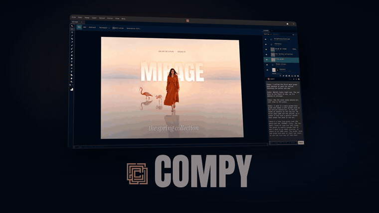
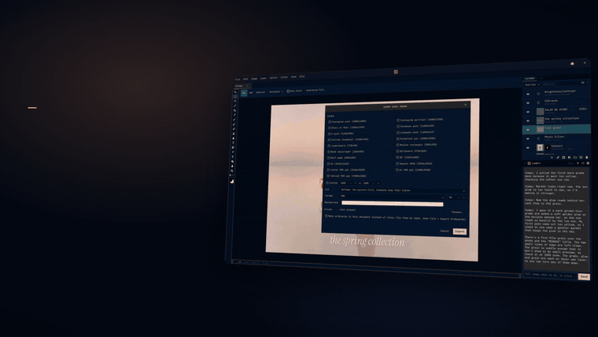
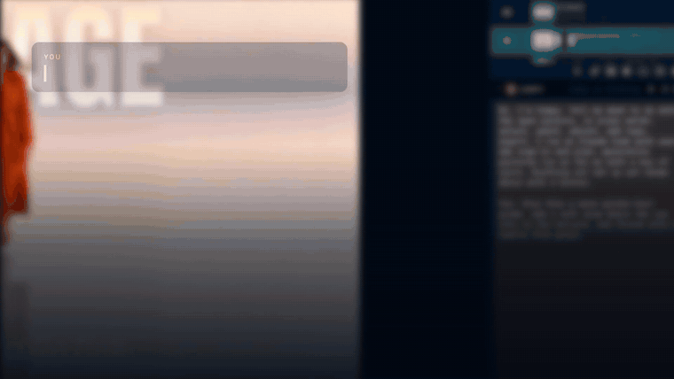
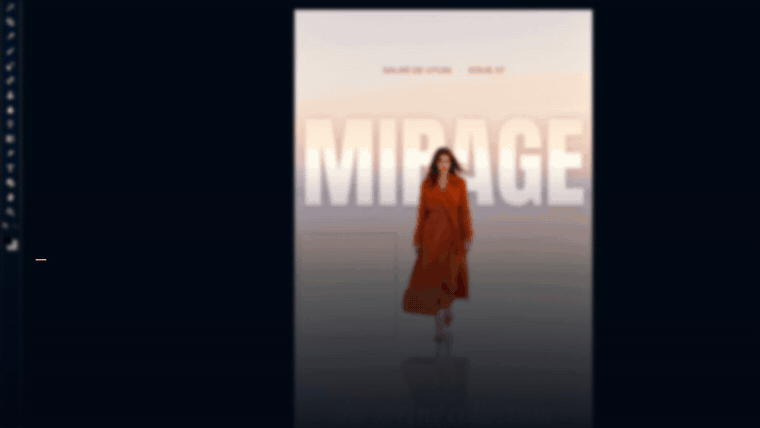

# Compy

A layer-based image editor for Linux, in the shape of Photoshop, with an AI assistant built in. Native
GTK4, written in Rust, built for Omarchy and at home on any Linux desktop.

[](https://github.com/fluxcapctr/compy/releases/download/v0.1.1/compy-launch.mp4)

*Click for the full launch video with sound (87 seconds, 1080p).*

Compy started as a Linux rebuild of [Compositor](https://github.com/robbietilton/Compositor), a macOS
editor whose C pixel core (`csrc/`) is compiled here unchanged. Everything around it is new: the
compositing engine, the tools, the file formats and the assistant.

## Highlights

- **Layers like Photoshop's.** Groups, masks, clipping masks, adjustment layers, blend modes, layer styles,
  artboards, history. Every change is one undo step.
- **The tools, the shortcuts and the menus you already know.** Photoshop's layout, so your hands do not
  have to relearn anything.
- **Files.** Its own `.comp` project, Photoshop `.psd` in and out with editable type and layer styles,
  and the usual image formats. Export one document to every ad and social size at once, reframed, or as
  artboards to fix by hand:

  
- **Compy, the assistant.** Ctrl+K. Tell it what you want and it does the work on layers you can still
  edit, through Claude Code with your own sign-in. With a fal.ai key it also generates, fills, extends,
  upscales and relights. One sentence in, a graded photo out (sped up while it works):

  

- **Generative Fill and Expand.** Select an area, or ask for more canvas, and describe what belongs
  there. Here two flamingos are painted into a selection, then the portrait grows into a panorama:

  

- **Made for Omarchy.** The whole chrome follows the active Omarchy theme, live. The assistant is Claude
  Code, the same agent you use with Omarchy; if it is not installed or signed in yet, Compy offers a
  button that does it. Dictation through voxtype. Runs on any other Linux desktop too, with the stock
  GTK look.

## What is in it

**Tools:** Move, Marquee, Lasso, Magic Wand, Crop, Eyedropper, Brush, Eraser, Spot Healing Brush, Clone
Stamp, Pattern Stamp, Blur, Smudge, Liquify, Dodge, Burn, Sponge, Gradient, Pen, Shape, Type, Hand, Zoom.

**Layers:** groups, layer masks, clipping masks, blend modes, opacity, artboards, Free Transform, free
distort, align and distribute, merge and stamp, layer styles (drop shadow, inner shadow, outer glow,
inner glow, bevel and emboss, stroke, color overlay, gradient overlay, pattern overlay, Blend If).

**Adjustments:** Levels, Curves, Exposure, Hue/Saturation, Color Balance, Brightness/Contrast, Vibrance,
Black & White, Photo Filter, Threshold, Posterize, Shadows/Highlights, Selective Color, Channel Mixer,
Gradient Map, Grain, Auto Tone, Auto Contrast, Auto Color, Invert, Desaturate. All but the autos are
adjustment layers too.

**Filters:** Gaussian Blur, Motion Blur, Radial Blur, Unsharp Mask, Smart Sharpen, High Pass, Add
Noise, Lens Correction, Remove Background, Content-Aware Fill, Heal Selection, Fade.

**Selections:** rectangle and ellipse marquee, freehand and polygonal lasso, wand, Color Range, from a
path, from layer pixels, feather, expand, contract, stroke, fill, define and fill with a pattern.

**Type and vector:** point and paragraph type, Bezier paths, shapes from paths that stay editable,
rectangles and ellipses with corner radius.

**Brushes:** Photoshop `.abr` and GIMP `.gbr` and `.gih` brush files, textured tips, patterns from
`.abr` and `.pat` files, a right-click brush popover.

**Files:** `.comp` projects, `.psd` in and out, PNG, JPEG, TIFF, GIF, WebP, AVIF, BMP and HEIC in,
PNG, JPEG, WebP, GIF, AVIF and PSD out, Export Sizes, Export Layers, Export Artboards, autosave with
recovery.

**Assistant tools:** everything above through Claude Code, plus Generative Fill, Generative Expand,
new pictures from a prompt, image edits by instruction, upscaling and relighting on fal.ai.

The full manual, every feature in detail, is in [docs/MANUAL.md](docs/MANUAL.md).

The binary and the crate are still called `compositor`, so every command in the manual keeps working;
`compy` is an alias.

## Install

**One line, any Linux:**

```
curl -fsSL https://raw.githubusercontent.com/fluxcapctr/compy/main/get.sh | bash
```

On Omarchy and Arch that builds a proper package and installs it with pacman (sudo asks once).
Elsewhere it fetches the latest release and installs it under `~/.local`. Then open Compy from the app
menu, or run `compy`.

**Omarchy and Arch by hand**, the same package the line above builds:

```
git clone https://github.com/fluxcapctr/compy.git
cd compy/packaging/aur
makepkg -si
```

That builds `compy-git`, installs it with pacman, and puts Compy in the app launcher; `compy` runs it
from a terminal. Update later by running the same `makepkg -si` again.

**Any Linux**, from a release: download the tarball from the Releases page, unpack it, and run
`./install.sh` inside. It puts the binary in `~/.local/bin`, the image libraries it was built with in
`~/.local/lib/compy`, the icon and desktop entry under `~/.local/share`, and touches nothing in
`/usr`. Needs GTK 4.14 or newer from the distribution (Ubuntu 24.04, Fedora 40, Debian 13 or newer).

**From source**: a Rust toolchain plus the development packages (`gtk4 cairo pango libheif` on Arch;
`libgtk-4-dev libcairo2-dev libpango1.0-dev libheif-dev` on Debian and Ubuntu), then

```
git clone https://github.com/fluxcapctr/compy.git
cd compy
./install.sh
```

The `reference/` submodule (the macOS original, used as the specification) is not needed to build.

**AI setup, inside the app.** Press Ctrl+K. If anything is missing the assistant shows a strip with a
button for each thing: "Install Claude Code" or "Sign in to Claude Code" opens a terminal that does
exactly that (if you already use Claude Code with Omarchy, at most it is the sign-in), and "Add
fal.ai key" takes the key for generative pictures (fill, expand, new pictures, upscaling, relighting;
a few cents a picture, billed to your fal account). Everything else in Compy works without either.
Help > Set Up AI Tools brings the strip back any time. Optional: `libavif` for AVIF export and
`voxtype` for dictation.

## Build

Rust (stable, edition 2024), a C compiler, the GTK4, Cairo and libheif development packages. The first
build fetches the ONNX Runtime library once.

```
git clone https://github.com/fluxcapctr/compy.git
cd compy
cargo build --release
cargo test
./install.sh
```

`install.sh` installs for the current user only, under `~/.local`. The `reference/` submodule (the macOS
original, used as the specification) is not needed to build.

## License

MIT. The pixel core and the original app are Compositor by Wonder Assembly LLC, also MIT.
